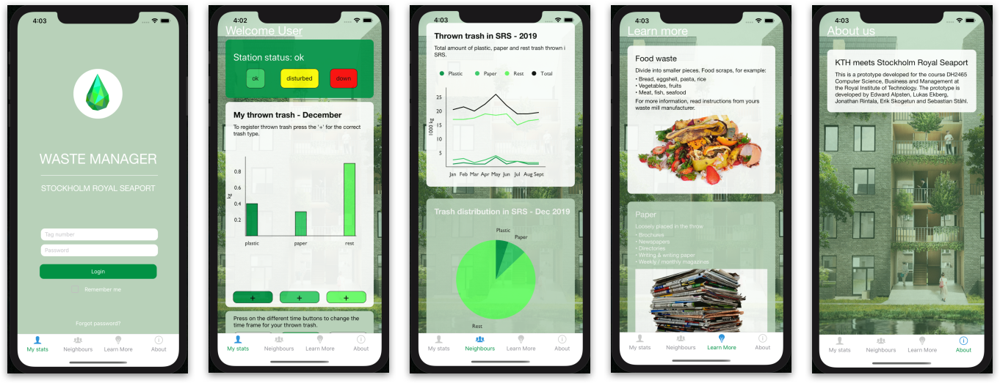

# waste-manager

## Functional application (React Native)

This application was produced as part of a larger project course where the following aim was adressed *“Create a feedback loop from individualized user data to create incentives to improve waste management behaviour.”*. The application is intended to be used as a complementary feedback loop for residents in Stockholm Royal Seaport (SRS) http://www.stockholmroyalseaport.com/ where an automated vacuum system for waste management is implemented. The application utilizes gamification, and considers various psychological aspects to improve sorting and management of waste. Read more about the project and our story: https://erikskogetun.github.io/WasteManagement/.

### Run project locally

The application is built in React Native and Expo. So simply run `npm install` to install all the dependencies, and then `npm start` to run the app in Expo. Then follow the instruction to run in simulator or on native device. We built the app mainly to support iOS and iPhone 11 Pro Max, but should work fine with some minor adjustments forother devices and Android as well.

### Demo

### Screenshots

## High-fi prototype (Adobe XD)

An initial prototype that was the base for the functional implementation.

## Contributors

The project was conducted by:

- Edward Alpsten
- Lukas Ekberg
- Jonathan Rintala
- Erik Skogetun
- Sebastian Ståhl

The code is produced by:

- <a href="https://github.com/rintala">Jonathan Rintala</a>
- <a href="https://github.com/sebastianstaahl">Sebastian Ståhl</a>

